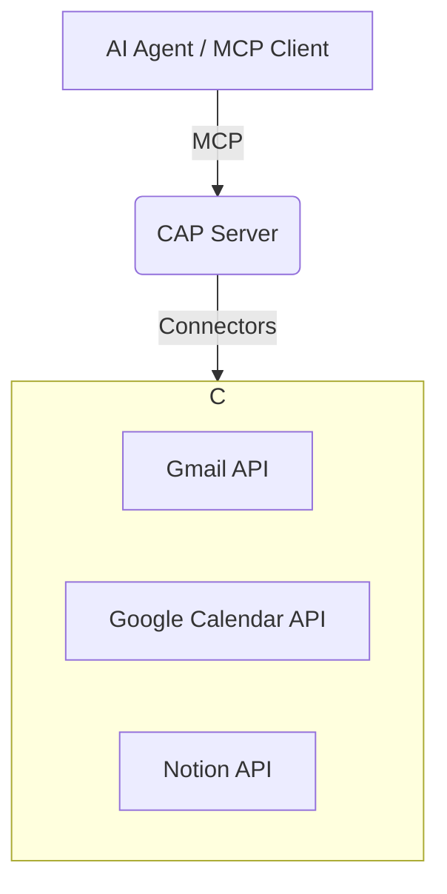

> **CAP: The Data Layer for AI Agents.**

# Claw Agent Protocol (CAP)

CAP is a lightweight **Model Context Protocol (MCP) server** that provides a canonical, real-time view of your personal data for AI agents. It connects to your existing data sources (Gmail, Google Calendar, Notion, etc.) on-demand, eliminating the need for local databases and complex setup.

It solves the #1 problem holding agents back: **data chaos**.

## The Problem

Agents fail not because they aren't smart, but because your data is scattered across a dozen apps with no common structure. CAP fixes this by providing a clean, consistent schema for your digital life.

## The Solution: Real-Time Translation

Instead of copying all your data into a local database, CAP acts as a **real-time translation layer**.

-   **Data stays at the source**: Secure in Google, Microsoft, etc.
-   **Queries are on-demand**: CAP fetches data live when an agent needs it.
-   **Security is delegated**: Permissions are handled by robust, familiar OAuth flows from your service providers.



## The "Slam Dunk" User Experience

1.  **Install**: `pip install claw-agent-protocol`
2.  **Configure**: `cap-server auth` (This opens a browser to connect your accounts via OAuth).
3.  **Run**: `cap-server run`
4.  **Connect**: Add the local CAP server to your MCP client (e.g., OpenClaw, Claude).

That's it. Your agent can now query your life through a clean, canonical schema.

## How It Works: Shelves and Views

CAP exposes your data through two MCP constructs:

### 1. Resources (The Shelves)

Raw, normalized data from your sources, accessible via canonical URIs.

| Shelf | Resource URI | Description |
|---|---|---|
| Identity | `cap://identity` | People, orgs, contacts |
| Comms | `cap://comms` | Messages, emails, threads |
| Calendar | `cap://calendar` | Events, availability |
| Docs | `cap://docs` | Notes, files, snippets |
| Tasks | `cap://tasks` | Tasks, projects, milestones |

**Example Query:** `read cap://calendar?start_date=today`

### 2. Tools (The Views)

High-level, task-oriented functions that often combine data from multiple shelves.

| View | Tool Name | Description |
|---|---|---|
| Today Briefing | `today_briefing` | Get your daily briefing of events, tasks, and comms. |
| Client Pipeline | `client_pipeline` | Get an overview of contacts, comms, and tasks by client. |
| Knowledge Search | `knowledge_search` | Search across all your documents and notes. |

**Example Tool Call:** `tools.today_briefing()`

## Getting Started

### Prerequisites

-   Python 3.10+
-   An MCP-compatible client (e.g., OpenClaw, Claude Desktop)

### Installation

```bash
pip install claw-agent-protocol
```

### Configuration

Run the authentication flow to connect your accounts:

```bash
cap-server auth
# Follow the on-screen instructions to open your browser and connect accounts.
```

### Running the Server

```bash
cap-server run
```

### Connecting to Your Agent

Add the CAP server to your MCP client. For OpenClaw, you would add it to your `openclaw.json` configuration.

## Documentation

-   **[Whitepaper](docs/whitepaper.md)**: The full vision and architecture.
-   **[Schema Reference](docs/schema.md)**: Detailed definitions of the CAP shelves.
-   **[Connector Guide](docs/connectors.md)**: How to build new connectors.

## Author

CAP is created by Jason Fleagle. Jason is a Chief AI Officer and Growth Consultant working with global brands to help with their successful AI adoption and management. He is also a writer, entrepreneur, and consultant specializing in tech, marketing, and growth. He helps humanize data—so every growth decision an organization makes is rooted in clarity and confidence. Jason has helped lead the development and delivery of over 500 AI projects & tools, and frequently conducts training workshops to help companies understand and adopt AI. With a strong background in digital marketing, content strategy, and technology, he combines technical expertise with business acumen to create scalable solutions. He is also a content creator, producing videos, workshops, and thought leadership on AI, entrepreneurship, and growth. He continues to explore ways to leverage AI for good and improve human-to-human connections while balancing family, business, and creative pursuits.

## Contributing

CAP is an open-source project. Contributions are welcome! Please see `CONTRIBUTING.md` for guidelines.

## License

MIT License. See `LICENSE` for details.
