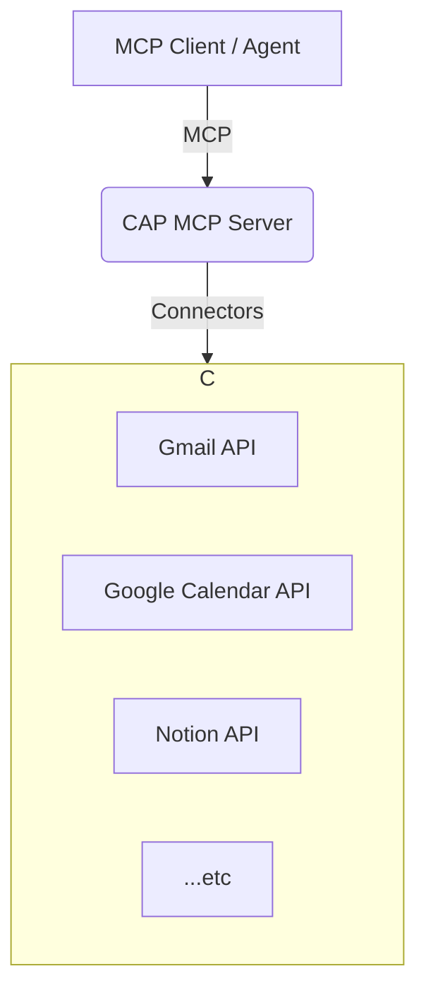

# The Claw Agent Protocol (CAP)

## A Canonical Personal Ops Schema for the Age of Autonomous Agents

**Version 2.0 | February 2026**

**Author:** Jason Fleagle

---

## Abstract

The rapid proliferation of powerful, open-source AI agents has marked a new frontier in personal computing. However, their effectiveness is crippled by a fundamental bottleneck: the chaotic, unstructured, and insecure nature of personal data. The Claw Agent Protocol (CAP) is a lightweight, **Model Context Protocol (MCP) server** that solves this problem by acting as a real-time translation layer between a user's existing data sources and the clean, canonical schema that agents need. By eliminating local databases and complex setup, CAP provides a "slam dunk" user experience, making it the essential data layer for the agent era.

---

## 1. The Data Chaos Problem

Autonomous agents, for all their promise, consistently fail when confronted with the reality of a user's digital life. Data is scattered across dozens of SaaS applications, each with its own proprietary API and data structure. An agent tasked with a simple request like "summarize my client communications from this week" must contend with a chaotic landscape of Gmail, Slack, Notion, and a dozen other services. This is not an intelligence problem; it is a **data access and organization problem**.

Previous attempts to solve this have focused on data warehousing—ingesting all data into a central, local database. While powerful, this approach suffers from significant adoption friction:

-   **High Setup Cost**: Users are required to install databases, configure adapters, and manage complex ingestion pipelines.
-   **Data Staleness**: The local copy of the data is often out of date.
-   **Security Burden**: The user is responsible for securing a centralized store of all their most sensitive information.

## 2. The Solution: CAP as a Real-Time Translation Layer

CAP abandons the data warehousing model in favor of a more elegant, lightweight approach: **CAP is an MCP server that translates data on-demand.**

### 2.1. Core Principle: No Local Database

-   **Data stays at the source**: Your data remains in Google, Notion, Slack, etc.
-   **Queries are on-demand**: When an agent requests data, CAP fetches it from the source API in real-time.
-   **Security is delegated**: Permissions are handled by the source provider's robust OAuth implementation.

This eliminates setup friction and ensures that agents always have access to the most up-to-date information, without creating a new, high-value target for attackers.

### 2.2. Architecture: MCP-Native by Design

By implementing CAP as a standard MCP server, it becomes instantly compatible with any MCP-enabled client, such as OpenClaw or Claude.

-   The **CAP MCP Server** exposes a set of canonical "shelves" as MCP Resources.
-   **Connectors** are modules that handle the real-time communication with each external data source.

## 3. The CAP Schema: Shelves and Views

CAP provides a clean, predictable structure for personal data, organized into two main constructs.

### 3.1. Resources: The Canonical Shelves

Each category of personal data is exposed as a read-only MCP Resource. This provides agents with direct, structured access to the user's information.

| Shelf | Resource URI | Description |
|---|---|---|
| Identity | `cap://identity` | People, orgs, contacts |
| Comms | `cap://comms` | Messages, emails, threads |
| Calendar | `cap://calendar` | Events, availability |
| Docs | `cap://docs` | Notes, files, snippets |
| Tasks | `cap://tasks` | Tasks, projects, milestones |

### 3.2. Tools: Task-Oriented Views

For more complex operations, CAP provides a set of MCP Tools that act as pre-compiled "views" of the data. These views often combine information from multiple shelves to answer a specific, high-level question.

| View | Tool Name | Description |
|---|---|---|
| Today Briefing | `today_briefing` | Get calendar, due tasks, and recent comms for today. |
| Client Pipeline | `client_pipeline` | Get contacts, comms, and tasks organized by client. |
| Knowledge Search | `knowledge_search` | Search across all documents and notes. |

## 4. The "Slam Dunk" User Experience

The primary design goal of CAP is to eliminate adoption friction. The entire user experience is designed to be as simple as possible.

1.  **Installation**: A single command (`pip install cap-server`).
2.  **Authentication**: On first run, the user is directed to a simple web UI to connect their accounts via standard OAuth flows. This is a one-time setup.
3.  **Connection**: The user adds the local CAP server address to their MCP client.
4.  **Done**: The agent can now seamlessly query all connected data sources through the clean and consistent CAP schema.

## 5. The Path to Adoption

By pivoting to an MCP-native, real-time translation model, CAP is positioned to become the de facto standard for personal data access in the agent ecosystem. It solves a real, painful problem for both users and developers, without introducing the complexity and security burdens of previous solutions.

### 5.1. For Users

CAP empowers users to safely and effectively leverage AI agents to manage their digital lives. It provides a single point of control for data access, with permissions managed by the trusted, familiar interfaces of their existing service providers.

### 5.2. For Developers

CAP provides a stable, predictable target for agent development. Instead of writing and maintaining dozens of fragile, custom API integrations, developers can build agents that speak the universal language of the CAP schema.

## 6. Conclusion

The promise of autonomous agents can only be realized when the data chaos problem is solved. CAP provides the solution: a simple, secure, and powerful protocol that brings order to the chaos. By acting as a real-time translation layer, CAP unlocks the true potential of the agent era, making it an indispensable component of the modern AI stack.
